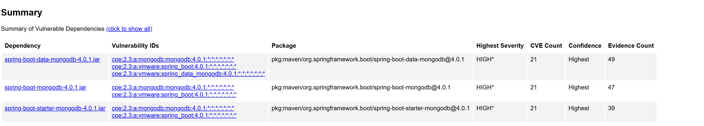

= Dependency-Check Spring Boot 4 MongoDB – Minimal Reproducer

This repository is a minimal reproducible project for demonstrating false positives in OWASP Dependency-Check
when scanning Spring Boot 4 MongoDB dependencies.

== Purpose

This project exists only to reproduce the following Dependency-Check issues:

- https://github.com/dependency-check/DependencyCheck/issues/8209
- https://github.com/dependency-check/DependencyCheck/issues/8208
- https://github.com/dependency-check/DependencyCheck/issues/8210

== Project Setup

- Java
- Spring Boot 4.x
- Gradle
- MongoDB Spring Boot starters

No application logic is relevant.

== Steps to Reproduce

Clone the repository:

[source,bash]
----
git clone https://github.com/waileong/dependency-check-spring-boot-4-mongodb.git
cd dependency-check-spring-boot-4-mongodb
----

Run Dependency-Check with Gradle (verbose mode):

[source,bash]
----
./gradlew clean dependencyCheckAnalyze -i
----

== Results

Dependency-Check produces findings for the following Spring Boot modules:

- spring-boot-starter-data-mongodb
- spring-boot-data-mongodb

These findings are false positives when using Spring Boot 4.x.

The generated report can be found at:

build/reports/dependency-check-report.html
